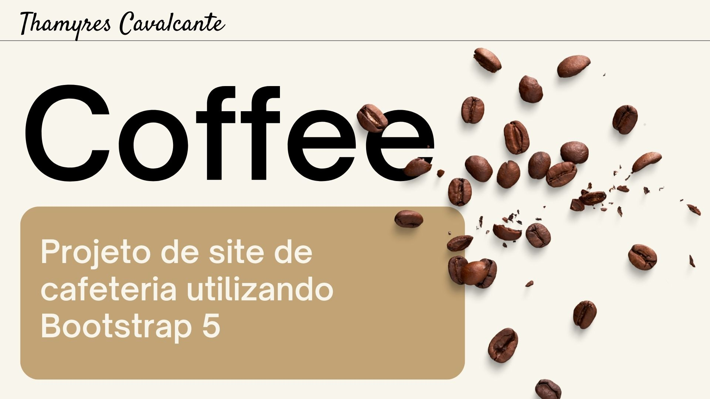
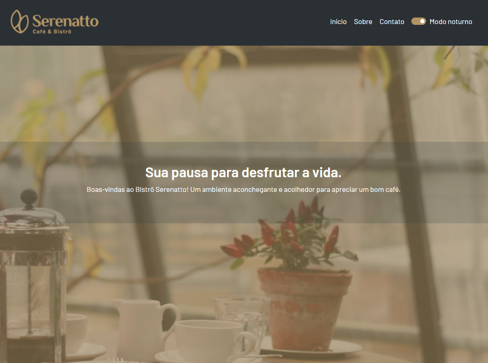
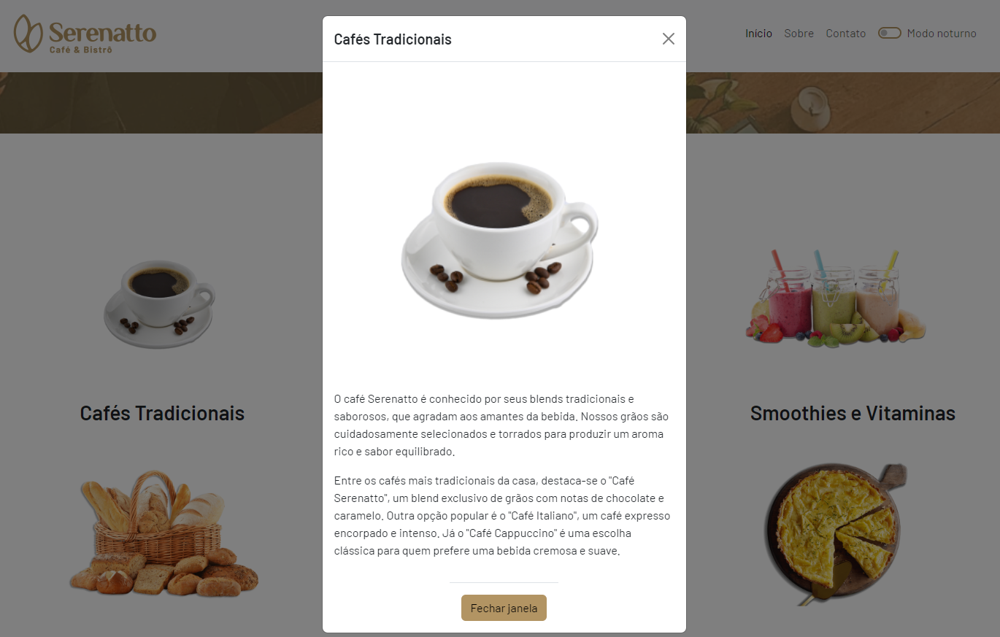
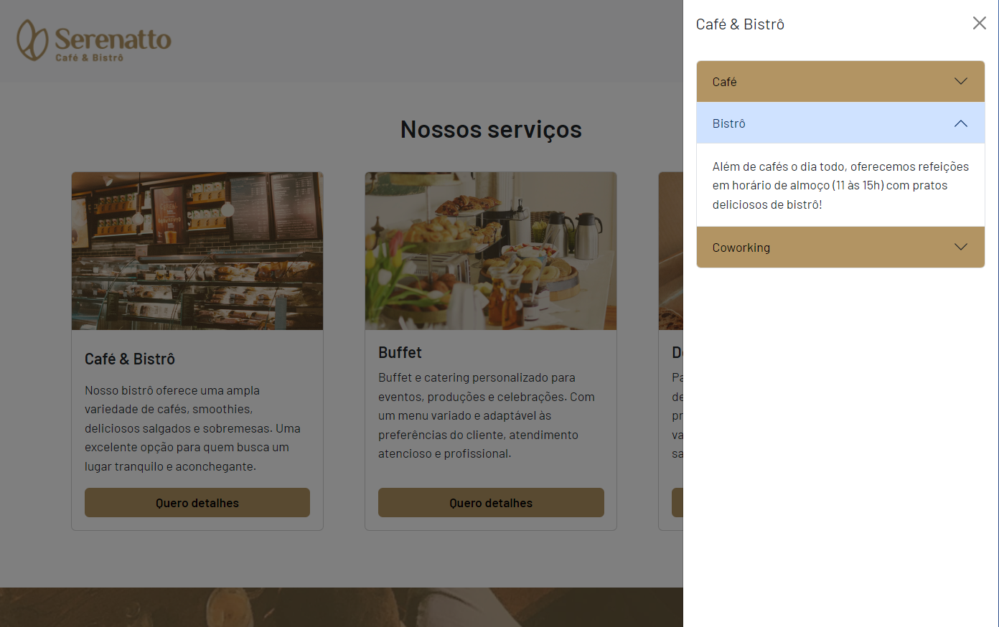

# Projeto Cafeteria Serenatto utilizando Bootstrap

| :placard: Vitrine.Dev |     |
| -------------  | --- |
| :sparkles: Nome        | **Projeto Cafeteria Serenatto utilizando Bootstrap**
| :label: Tecnologias | HTML, CSS, Bootstrap5
| :rocket: URL         | https://thamyresmya.github.io

 

  <a href="#-tecnologias">Tecnologias</a>&nbsp;&nbsp;&nbsp;|&nbsp;&nbsp;&nbsp;  
  <a href="#-projeto">Projeto</a>&nbsp;&nbsp;&nbsp;|&nbsp;&nbsp;&nbsp;  
  <a href="#-gif">Gif</a>&nbsp;&nbsp;&nbsp;&nbsp;&nbsp;&nbsp;

 

## 🚀 Tecnologias

Esse projeto foi desenvolvido com as seguintes tecnologias:

- HTML
- CSS
- Bootstrap 5

 

## 💻 Projeto

Projeto de uma cafeteria Serenatto fictícia utilizando Bootstrap na versão 5, HTML e CSS. 🚀

 

## 📁 Acesso ao projeto

É possível acessar o projeto através do [Link](https://github.com/Thamyresmya)

 

## ✔️ Explicação
<h2>Breakpoints no Bootstrap</h2>
O Bootstrap tem a funcionalidade de breakpoints, ou pontos de quebra, eles são usados para aplicar determinados estilos de acordo com a largura da página. Auxiliando na responsividade e ajustando o layout para diferentes dispositivos.

</img>

<video width="100%" height="340" controls>
  <source src="./geral/img/Breakpoints.mp4" type="video/mp4">
</video>

 

## 📸 Gif

Tela principal  
</img>

Tela principal - modo noturno  
</img>

Elemento modal  
</img>

Elemento Off-canvas e Accordion  
</img>

 

Me siga nas redes sociais:
- [Linkedin](https://www.linkedin.com/in/thamyrescavalcante/)
- [Instagran](https://www.instagram.com/thamyres__cavalcante/)

 

---

Feito com ♥ by Thamyres Cavalcante.

